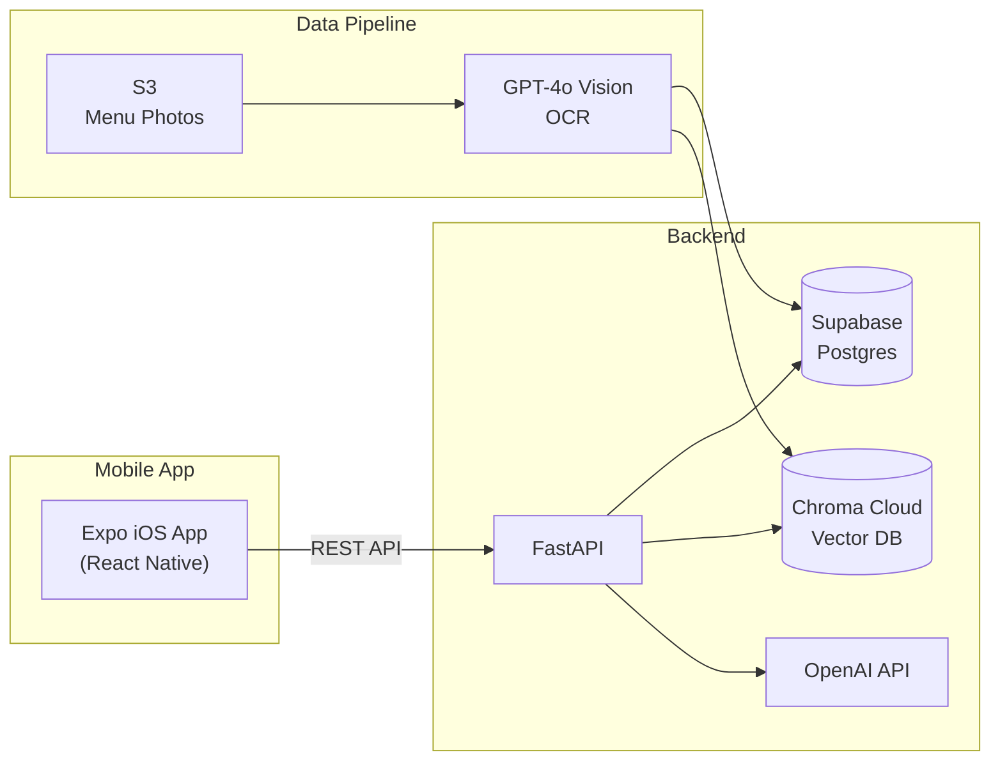

# Restaurant Nutrition MVP

Users get **calorie and macro (KBZhU: calories, protein, fat, carbs)** estimates for restaurant dishes, backed by structured data extracted from menu photos.

The service consists of a **FastAPI backend** and a **React Native (Expo) mobile app** for iOS.

## Architecture



### API endpoints

| Endpoint | Description |
|----------|-------------|
| `GET /restaurants` | List restaurants (optional `?query=` filter) |
| `GET /dishes` | List dishes for a restaurant (`?restaurant_id=`) |
| `GET /dishes/search` | Quick search by dish name / restaurant |
| `POST /user/restaurant` | Save user's restaurant selection |
| `POST /user/dish` | Save user's dish selection |
| `GET /user/result` | Get nutrition result for saved dish |
| `GET /search` | Keyword search with Russian-to-English translation |
| `GET /rag/search` | Semantic search over menu text via Chroma Cloud |

## Prerequisites

- **Python 3.12+** (backend)
- **Node.js 20+** (mobile app)
- An iPhone with **Expo Go** installed from the App Store (for testing)
- **ngrok v3+** (only for tunnel mode — see [Restricted networks](#restricted-networks-vpn--tunnel))

## Setup

### Backend

The setup script creates a virtual environment, installs dependencies, and prepares the `.env` config file:

```bash
git clone https://github.com/PaulPchel/first_agent_code.git
cd first_agent_code
./setup.sh
```

Fill in your `.env` with the shared credentials (ask the team):
- `DATABASE_URL` — Supabase Postgres connection string
- `OPENAI_API_KEY` — OpenAI API key
- `CHROMA_CLOUD_*` — Chroma Cloud tenant, database, and API key
- `NGROK_AUTHTOKEN` — ngrok auth token (only needed for tunnel mode, see below)

<details>
<summary>Manual setup (without setup.sh)</summary>

```bash
python3.12 -m venv .venv
source .venv/bin/activate
pip install -r requirements.txt
cp .env.example .env   # then fill in credentials
```

</details>

### Mobile app

```bash
cd mobile
npm install
```

## Running

### 1. Start the backend

Bind to `0.0.0.0` so the mobile app can reach it over your local network:

```bash
source .venv/bin/activate
uvicorn app.main:app --host 0.0.0.0 --port 8000
```

### 2. Start the mobile app

In a separate terminal:

```bash
cd mobile
npx expo start
```

Scan the QR code with your iPhone camera to open the app in Expo Go. Your phone must be on the same Wi-Fi network as your Mac. Also you need to turn on the local network in your Expo Go IOs settings to load the restaurants.

**API base URL:** the mobile app connects to your Mac's local IP (configured in `mobile/services/api.ts`). If your IP changes, update the `API_BASE` value there.

### Restricted networks (VPN + tunnel)

If your network blocks connections to Supabase (e.g. country-level restrictions), you need a VPN to reach the database. However, VPN usually breaks the Expo LAN connection between your Mac and iPhone.

**Solution:** run a split VPN + ngrok tunnel.

#### One-time setup

1. **Install ngrok v3+**:

```bash
brew install ngrok
```

2. **Authenticate** (free account — sign up at [ngrok.com](https://ngrok.com)):

```bash
ngrok authtoken $NGROK_AUTHTOKEN
```

#### Running with tunnel

Start your **VPN**, then:

```bash
# Terminal 1 — backend
source .venv/bin/activate
uvicorn app.main:app --host 0.0.0.0 --port 8000

# Terminal 2 — mobile app with tunnel (starts ngrok + Expo together)
cd mobile
npm run tunnel
```

The script starts ngrok, gets the public URL, and launches Expo with `EXPO_PACKAGER_PROXY_URL` set so the QR code points through the tunnel. Scan it with Expo Go as usual — no need to be on the same Wi-Fi.

<details>
<summary>Manual steps (without the helper script)</summary>

```bash
# Terminal 2 — start ngrok
ngrok http 8081

# Terminal 3 — copy the https://xxxx.ngrok-free.app URL from ngrok, then:
cd mobile
EXPO_PACKAGER_PROXY_URL=https://xxxx.ngrok-free.app npx expo start --port 8081
```

</details>

> **Tip:** if your VPN supports split tunneling, route only Supabase traffic (`aws-0-eu-west-1.pooler.supabase.com`) through the VPN. This lets LAN mode (`npx expo start`) work without ngrok.

### Web frontend (legacy)

The original web UI is still available at http://127.0.0.1:8000 when the backend is running. It lives in `frontend/` and is served by FastAPI.

## Project structure

```
first_agent_code/
├── app/                    # FastAPI backend
│   ├── main.py             #   app entry point, router wiring, startup seed
│   ├── api/                #   route handlers (dishes, search, rag)
│   ├── db/                 #   SQLAlchemy models, engine, seed
│   ├── services/           #   search service with translation
│   └── scripts/            #   offline data pipeline (S3, OCR, vectorDB)
├── mobile/                 # React Native (Expo) iOS app
│   ├── app/                #   screens (Expo Router file-based routing)
│   ├── components/         #   DishCard, NutritionGrid
│   ├── services/           #   API client, user ID persistence
│   └── constants/          #   theme colors
├── frontend/               # legacy web frontend (vanilla HTML/CSS/JS)
├── tests/                  # pytest test suite
├── requirements.txt        # Python dependencies
├── setup.sh                # one-command backend setup
└── .github/workflows/      # CI (GitHub Actions)
```

## Testing

All PRs to `main` are tested automatically via GitHub Actions. Tests must pass before merging.

```bash
source .venv/bin/activate
python3 -m pytest tests/ -v
```

| Test file | What it covers |
|-----------|----------------|
| `test_dishes.py` | Dish model, `GET /dishes/search` endpoint |
| `test_services.py` | Search service, translation |
| `test_db.py` | Food model, seed data idempotency |
| `test_api_search.py` | `GET /search` endpoint |
| `test_api_rag.py` | `GET /rag/search` endpoint (OpenAI and ChromaDB are mocked) |
| `test_frontend_sanity.py` | `app.js` calls the real API, required HTML elements exist |

### Rules for contributors

1. Run tests locally before pushing: `python3 -m pytest tests/ -v`
2. Do not merge if CI is red — fix the failing tests first
3. Add tests when introducing new endpoints or changing search logic

## Team

| Person | Focus |
|--------|-------|
| **Artem** | Collect menus (Anya + friends); freelance (FL) task for menu collection; estimate cost of the test. |
| **Pavel** | Architecture & Git (PRs); choose interface; choose database and data model; research Yandex API; parser baseline design. |
