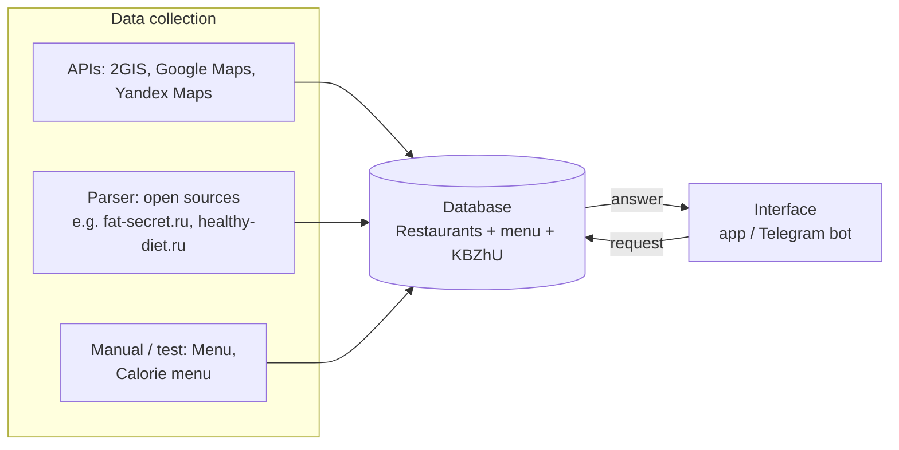

# Restaurant nutrition MVP (one-week test)

Short test sprint to validate a flow where users get **calorie and macro (KBZhU: calories, protein, fat, carbs)** estimates for restaurant dishes, backed by structured data and simple UX.

## Architecture

### Data sources

| Source | Role |
|--------|------|
| **APIs** | Pull venue and related data from **2GIS**, **Google Maps**, **Yandex Maps**. |
| **Parser** | Scrape or normalize **open sources** (e.g. fat-secret.ru, healthy-diet.ru). |
| **Manual (test)** | **Menu** and **calorie menu** datasets for the test phase until pipelines are stable. |

### Database

Central store: **restaurants**, **menu items**, and **KBZhU** (nutritional fields) so the product can answer queries from structured data.

### User interface

**Mobile app or Telegram bot** — users can send:

- restaurant / dish text,
- **photo of a receipt**,
- **photo of a dish**.

The client sends a **request** to the backend; the backend reads/writes the database and returns an **answer** (e.g. matched dish + nutrition).

## Responsibilities (sprint)

| Person | Focus |
|--------|--------|
| **Artem** | Collect menus (Anya + friends); freelance (**FL**) task for menu collection; **estimate cost** of the test. |
| **Pavel** | **Architecture & Git (PRs)**; choose **interface**; choose **database** and **data model**; research **Yandex API**; **parser** baseline design. |

## Repo

This repository hosts the **architecture and implementation** work for the one-week test (per team plan).
