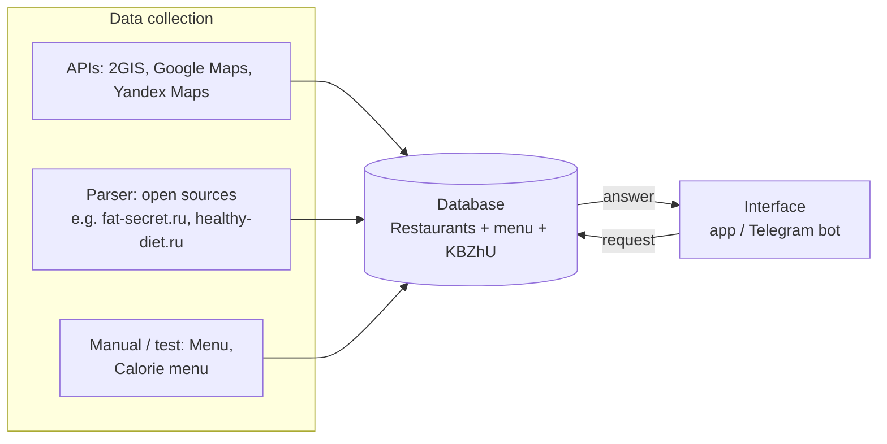

# Restaurant nutrition MVP (one-week test)

Short test sprint to validate a flow where users get **calorie and macro (KBZhU: calories, protein, fat, carbs)** estimates for restaurant dishes, backed by structured data and simple UX.

## Architecture



### Data sources

| Source | Role |
|--------|------|
| **APIs** | Pull venue and related data from **2GIS**, **Google Maps**, **Yandex Maps**. |
| **Parser** | Scrape or normalize **open sources** (e.g. fat-secret.ru, healthy-diet.ru). |
| **Manual (test)** | **Menu** and **calorie menu** datasets for the test phase until pipelines are stable. |

### Database

Central store: **restaurants**, **menu items**, and **KBZhU** (nutritional fields) so the product can answer queries from structured data.

### User interface

**Mobile app or Telegram bot** — users can send:

- restaurant / dish text,
- **photo of a receipt**,
- **photo of a dish**.

The client sends a **request** to the backend; the backend reads/writes the database and returns an **answer** (e.g. matched dish + nutrition).

## Responsibilities (sprint)

| Person | Focus |
|--------|--------|
| **Artem** | Collect menus (Anya + friends); freelance (**FL**) task for menu collection; **estimate cost** of the test. |
| **Pavel** | **Architecture & Git (PRs)**; choose **interface**; choose **database** and **data model**; research **Yandex API**; **parser** baseline design. |

## Setup

```bash
# Clone and install dependencies
git clone https://github.com/PaulPchel/first_agent_code.git
cd first_agent_code
pip install -r requirements.txt

# Create a .env file with your keys
cp .env.example .env   # then fill in OPENAI_API_KEY, AWS credentials, etc.

# Run the server
uvicorn app.main:app --reload
```

Open http://127.0.0.1:8000 in your browser.

## Testing

All PRs to `main` are tested automatically via GitHub Actions. **Tests must pass before merging.**

```bash
# Run the full suite (70 tests, <1 second)
python3 -m pytest tests/ -v
```

| Test file | What it covers |
|-----------|---------------|
| `test_utils.py` | Text normalization, Levenshtein distance, synonym expansion |
| `test_services.py` | Search service, translation, fuzzy ranking |
| `test_db.py` | Food model, seed data idempotency |
| `test_api_search.py` | `GET /search` endpoint |
| `test_api_rag.py` | `GET /rag/search` endpoint (OpenAI and ChromaDB are mocked) |
| `test_frontend_sanity.py` | `app.js` calls the real API, required HTML elements exist |

### Rules for contributors

1. **Run tests locally** before pushing: `python3 -m pytest tests/ -v`
2. **Do not merge** if CI is red — fix the failing tests first
3. **Add tests** when introducing new endpoints or changing search logic
4. **Do not replace** real API calls in `app.js` with hardcoded or mocked data — the frontend sanity tests will catch it

## Repo

This repository hosts the **architecture and implementation** work for the one-week test (per team plan).
